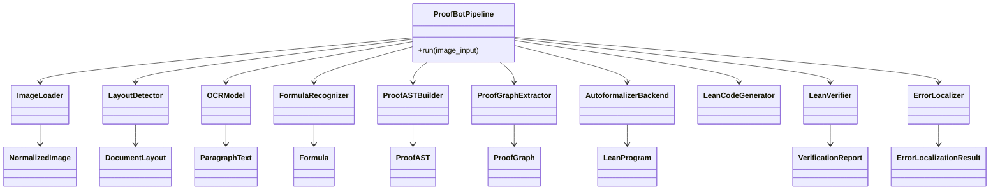

# ProofBot Architecture

## Overview

ProofBot is a modular research system for converting handwritten mathematical proofs into formally verified Lean proofs.

The architecture is designed around these principles:

- modularity
- strong typing
- stage isolation
- configuration-driven implementation selection
- clear data model boundaries
- research-friendly extensibility
- CPU/GPU-agnostic execution

---

## Proposed Repository Structure

```
proofbot/
  core/
    __init__.py
    config.py
    exceptions.py
    interfaces.py
    logging.py
    pipeline.py
    registry.py
    utils.py
  models/
    __init__.py
    document.py
    image.py
    layout.py
    ocr.py
    formula.py
    ast.py
    graph.py
    lean.py
    verification.py
  vision/
    __init__.py
    preprocessing/
      __init__.py
      config.py
      interfaces.py
      models.py
      pipeline.py
      quality.py
      detection.py
      perspective.py
      orientation.py
      lighting.py
      denoise.py
      super_resolution.py
      utils.py
    layout/
      __init__.py
      interfaces.py
      models.py
      detectors.py
      postprocessing.py
    ocr/
      __init__.py
      interfaces.py
      models.py
      recognizers.py
    formula/
      __init__.py
      interfaces.py
      models.py
      recognizers.py
  ast/
    __init__.py
    interfaces.py
    builder.py
    transformer.py
  graph/
    __init__.py
    interfaces.py
    models.py
    extractor.py
  autoformalization/
    __init__.py
    interfaces.py
    backends.py
    transformer.py
  lean/
    __init__.py
    codegen/
      __init__.py
      interfaces.py
      generator.py
    verification/
      __init__.py
      interfaces.py
      runner.py
    errors/
      __init__.py
      localization.py
  examples/
  tests/
  docs/
  README.md
  ARCHITECTURE.md
```

Shared infrastructure packages:

- `proofbot/core`
- `proofbot/models`
- `proofbot/config`
- `proofbot/interfaces`
- `proofbot/exceptions`
- `proofbot/utils`

These packages hold common abstractions, configuration loading, logging, and shared type definitions.

---

## High-level Module Responsibilities

### 1. Image Preprocessing

Output: `NormalizedImage`

Responsibilities:
- load images from file paths, PIL, NumPy
- preserve metadata where possible
- quality assessment (resolution, blur, brightness, contrast, glare, noise)
- detect document pages and page polygons
- perspective correction
- orientation normalization
- lighting normalization
- optional denoising
- optional super-resolution

### 2. Layout & Region Detection

Output: `DocumentLayout`

Responsibilities:
- detect logical handwritten document regions
- classify regions as paragraph, theorem, proof, equation, diagram, title, section, margin note
- return bounding boxes, normalized polygons, region type, and confidence

### 3. Handwriting OCR

Output: `ParagraphText`

Responsibilities:
- transcribe text from paragraph regions only
- return text with confidence per region

### 4. Formula Recognition

Output: `Formula`

Responsibilities:
- recognize handwritten mathematical expressions within equation regions
- return LaTeX or MathML plus confidence

### 5. Structured Proof AST

Output: `ProofAST`

Responsibilities:
- merge OCR and formula outputs into a structured symbolic proof representation
- encode assumptions, equations, deductions, references, definitions, conclusions
- preserve region provenance for traceability

### 6. Proof Relationship Extraction

Output: `ProofGraph`

Responsibilities:
- infer logical dependencies between AST nodes
- identify patterns such as derivations, contradictions, induction, case splits, theorem applications
- produce a graph of proof statements and dependency edges

### 7. Autoformalization

Output: `LeanIntermediateRepresentation`

Responsibilities:
- translate proof structure into Lean-style intermediate text/AST
- remain independent of any specific LLM provider
- support multiple backend drivers

### 8. Lean Code Generation

Output: `LeanProgram`

Responsibilities:
- convert Lean-style IR into compilable Lean source
- generate imports, namespaces, theorem declarations, tactics, and formatting

### 9. Lean Verification

Output: `VerificationReport`

Responsibilities:
- execute Lean on generated source
- capture errors, warnings, diagnostics, tactic failures
- preserve execution metadata such as timeout and environment

### 10. Error Localization

Output: `ErrorLocalizationResult`

Responsibilities:
- map Lean diagnostics back to Lean source positions
- connect Lean source positions to AST nodes
- connect AST nodes to original image coordinates
- support interactive feedback on the handwritten image

---

## Core Data Models

### Shared models

```python
@dataclass
class NormalizedImage:
    image: PIL.Image.Image
    metadata: ImageMetadata
    quality_report: QualityReport
    page_polygons: list[PagePolygon]
    preprocessing_history: list[StageResult]
```

```python
@dataclass
class ImageMetadata:
    source: str
    original_size: tuple[int, int]
    mode: str
    dpi: Optional[tuple[int, int]]
    extra: dict[str, Any]
```

@dataclass
class QualityReport:
    resolution_dpi: Optional[float]
    blur_score: Optional[float]
    brightness: Optional[float]
    contrast: Optional[float]
    glare_score: Optional[float]
    noise_level: Optional[float]
    recommendations: list[str]
```

@dataclass
class StageResult:
    name: str
    status: str
    details: dict[str, Any]
```

### Layout model

```python
@dataclass
class LayoutRegion:
    region_id: str
    region_type: RegionType
    bbox: BoundingBox
    confidence: float
    metadata: dict[str, Any]
```

@dataclass
class DocumentLayout:
    image_id: str
    regions: list[LayoutRegion]
```
```

### OCR and formula models

```python
@dataclass
class ParagraphText:
    region_id: str
    text: str
    confidence: float
    metadata: dict[str, Any]
```

@dataclass
class Formula:
    region_id: str
    latex: str
    mathml: Optional[str]
    confidence: float
    metadata: dict[str, Any]
```
```

### AST models

```python
class ProofNode(BaseModel):
    node_id: str
    node_type: ProofNodeType
    source_region: str
    text: Optional[str]
    formula: Optional[str]
    metadata: dict[str, Any]
```

@dataclass
class ProofAST:
    nodes: list[ProofNode]
    root_id: Optional[str]
    provenance: dict[str, Any]
```
```

### Graph models

```python
@dataclass
class ProofGraphEdge:
    source_id: str
    target_id: str
    relation: ProofRelationType
    confidence: float

@dataclass
class ProofGraph:
    nodes: list[ProofNode]
    edges: list[ProofGraphEdge]
```
```

### Lean models

```python
@dataclass
class LeanProgram:
    source: str
    module_name: str
    metadata: dict[str, Any]
```

@dataclass
class VerificationDiagnostic:
    line: int
    column: int
    severity: str
    message: str
    code: Optional[str]
    ast_node_id: Optional[str]
```

@dataclass
class VerificationReport:
    success: bool
    diagnostics: list[VerificationDiagnostic]
    runtime_ms: int
    details: dict[str, Any]
```
```

### Error localization

```python
@dataclass
class ErrorLocalizationResult:
    diagnostic: VerificationDiagnostic
    lean_span: TextSpan
    ast_node_id: Optional[str]
    image_coordinates: Optional[BoundingBox]
    explanation: Optional[str]
```
```

---

## Abstract Interfaces

Every AI-capable module implements an abstract interface.

### Vision / preprocessing interfaces

```python
class ImageLoader(ABC):
    def load(self, image_input: ImageInput) -> NormalizedImage: ...

class QualityAssessor(ABC):
    def assess(self, image: PIL.Image.Image, metadata: ImageMetadata) -> QualityReport: ...

class DocumentDetector(ABC):
    def detect(self, image: PIL.Image.Image) -> tuple[list[PageDetection], StageResult]: ...

class PerspectiveCorrector(ABC):
    def correct(self, image: PIL.Image.Image, page: PageDetection) -> tuple[PIL.Image.Image, StageResult]: ...
```

### Task-specific interfaces

```python
class LayoutDetector(ABC):
    def detect(self, image: NormalizedImage) -> DocumentLayout: ...

class OCRModel(ABC):
    def transcribe(self, image: PIL.Image.Image, region: LayoutRegion) -> ParagraphText: ...

class FormulaRecognizer(ABC):
    def recognize(self, image: PIL.Image.Image, region: LayoutRegion) -> Formula: ...

class ProofASTBuilder(ABC):
    def build(self, layout: DocumentLayout, paragraphs: list[ParagraphText], formulas: list[Formula]) -> ProofAST: ...

class ProofGraphExtractor(ABC):
    def extract(self, proof_ast: ProofAST) -> ProofGraph: ...

class AutoformalizerBackend(ABC):
    def formalize(self, proof_ast: ProofAST, proof_graph: ProofGraph) -> LeanIntermediateRepresentation: ...

class LeanCodeGenerator(ABC):
    def generate(self, lean_ir: LeanIntermediateRepresentation) -> LeanProgram: ...

class LeanVerifier(ABC):
    def verify(self, program: LeanProgram) -> VerificationReport: ...

class ErrorLocalizer(ABC):
    def localize(self, report: VerificationReport, proof_ast: ProofAST, layout: DocumentLayout) -> list[ErrorLocalizationResult]: ...
```

---

## Pipeline Orchestration

The system follows a deterministic pipeline where each stage consumes typed inputs and emits typed outputs.

### Example orchestration

```python
class ProofBotPipeline:
    def __init__(
        self,
        config: ProofBotConfig,
        loader: ImageLoader,
        layout_detector: LayoutDetector,
        ocr_model: OCRModel,
        formula_recognizer: FormulaRecognizer,
        ast_builder: ProofASTBuilder,
        graph_extractor: ProofGraphExtractor,
        autoformalizer: AutoformalizerBackend,
        code_generator: LeanCodeGenerator,
        verifier: LeanVerifier,
        error_localizer: ErrorLocalizer,
    ):
        ...

    def run(self, image_input: ImageInput) -> ProofBotResult:
        normalized = self.loader.load(image_input)
        layout = self.layout_detector.detect(normalized)
        paragraphs = [self.ocr_model.transcribe(normalized.image, r) for r in layout.paragraph_regions]
        formulas = [self.formula_recognizer.recognize(normalized.image, r) for r in layout.equation_regions]
        proof_ast = self.ast_builder.build(layout, paragraphs, formulas)
        proof_graph = self.graph_extractor.extract(proof_ast)
        lean_ir = self.autoformalizer.formalize(proof_ast, proof_graph)
        lean_program = self.code_generator.generate(lean_ir)
        verification = self.verifier.verify(lean_program)
        errors = self.error_localizer.localize(verification, proof_ast, layout)
        return ProofBotResult(...)
```
```

### Output wrapper

```python
@dataclass
class ProofBotResult:
    normalized_image: NormalizedImage
    layout: DocumentLayout
    paragraphs: list[ParagraphText]
    formulas: list[Formula]
    proof_ast: ProofAST
    proof_graph: ProofGraph
    lean_program: LeanProgram
    verification: VerificationReport
    error_localizations: list[ErrorLocalizationResult]
```
```

---

## Configuration Design

Configuration is YAML-driven and selects backend implementations without code changes.

### Example YAML

```yaml
vision:
  preprocessing:
    loader: pil
    quality_assessor:
      backend: basic
    document_detector:
      backend: simple
    perspective_corrector:
      backend: homography
    orientation_detector:
      backend: heuristic
    lighting_normalizer:
      backend: adaptive
    denoise:
      enabled: true
      backend: basic
    super_resolution:
      enabled: false
      backend: edsr
  layout:
    backend: transformer
    confidence_threshold: 0.4
ocr:
  backend: trocr
  language: en
  beam_size: 5
formula:
  backend: latexocr
  output_format: latex
ast:
  builder:
    backend: rule_based
graph:
  extractor:
    backend: learned
autoformalization:
  backend: openai
  model: gpt-4.1
  max_tokens: 4096
lean:
  codegen:
    backend: heuristic
  verification:
    timeout_seconds: 60
error_localization:
  backend: traceable
```
```

### Config loader

- `proofbot/core/config.py` loads YAML or environment overrides
- `proofbot/core/registry.py` maps backend names to concrete implementations
- `proofbot/core/pipeline.py` builds the pipeline from config

---

## Dependency Graph

### Core dependencies

- `proofbot/core` depends on `proofbot/models`
- all stage packages depend on `proofbot/models`
- `proofbot/vision/*` depends on `proofbot/core` and `proofbot/models`
- `proofbot/ast` depends on `proofbot/models`
- `proofbot/graph` depends on `proofbot/models`
- `proofbot/autoformalization` depends on `proofbot/models`
- `proofbot/lean` depends on `proofbot/models`
- `proofbot/error_localization` depends on `proofbot/models`

### Layered architecture

1. `core` + `models`
2. `vision.preprocessing`
3. `vision.layout`, `vision.ocr`, `vision.formula`
4. `ast`, `graph`
5. `autoformalization`
6. `lean`
7. `error_localization`

This preserves a directed acyclic dependency graph and isolates stage-specific implementation details.

---

## Extension Points

The architecture supports:

- new preprocessing backends
- new layout detectors
- new OCR and formula recognizers
- new formalization backends
- new Lean code generators
- new Lean verification runners
- new error localizers

Each extension must implement a defined interface and register via the config-driven backend factory.

### Example extension points

- `proofbot/vision/layout/interfaces.py`
- `proofbot/vision/ocr/interfaces.py`
- `proofbot/vision/formula/interfaces.py`
- `proofbot/ast/interfaces.py`
- `proofbot/graph/interfaces.py`
- `proofbot/autoformalization/interfaces.py`
- `proofbot/lean/codegen/interfaces.py`
- `proofbot/lean/verification/interfaces.py`
- `proofbot/lean/errors/interfaces.py`

---

## Recommended Design Patterns

- **Factory**: instantiate stage implementations from YAML-backed names
- **Strategy**: swap algorithms per stage through interface implementations
- **Dependency Injection**: inject concrete stages into the pipeline constructor
- **Pipeline**: model the overall flow as sequential stage execution
- **Observer / Event hooks**: emit lifecycle events for logging and benchmarking
- **Adapter**: convert external model outputs into internal typed models
- **Registry**: maintain available backend implementations centrally

---

## UML-style Class Relationships


```

---

## Notes for Research and Production

- Keep stage interfaces stable while model implementations evolve.
- Store provenance metadata at every stage for traceability.
- Use lightweight placeholder implementations for unit tests.
- Separate config parsing from pipeline assembly.
- Emit metrics and logs per stage to support benchmarking.
- Keep raw dictionaries out of stage contracts; prefer dataclasses or Pydantic models.

---

## Next Step

Implement the architecture skeleton as package scaffolding and then add the first concrete `vision.preprocessing` module.
