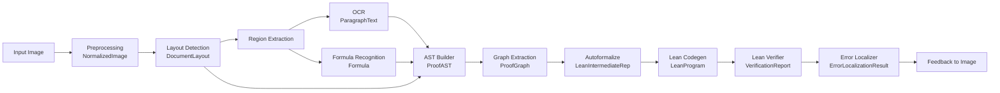
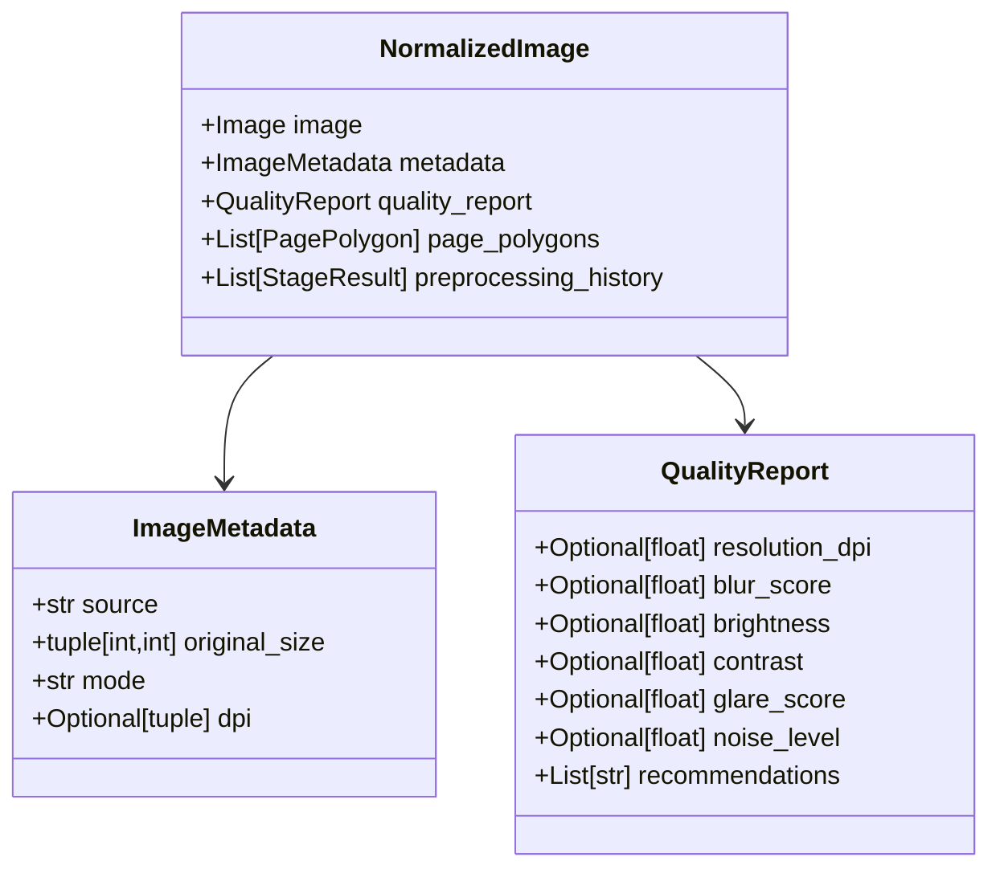
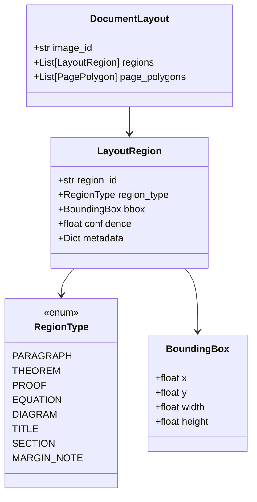
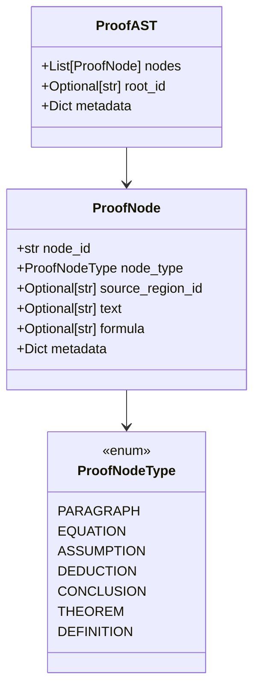
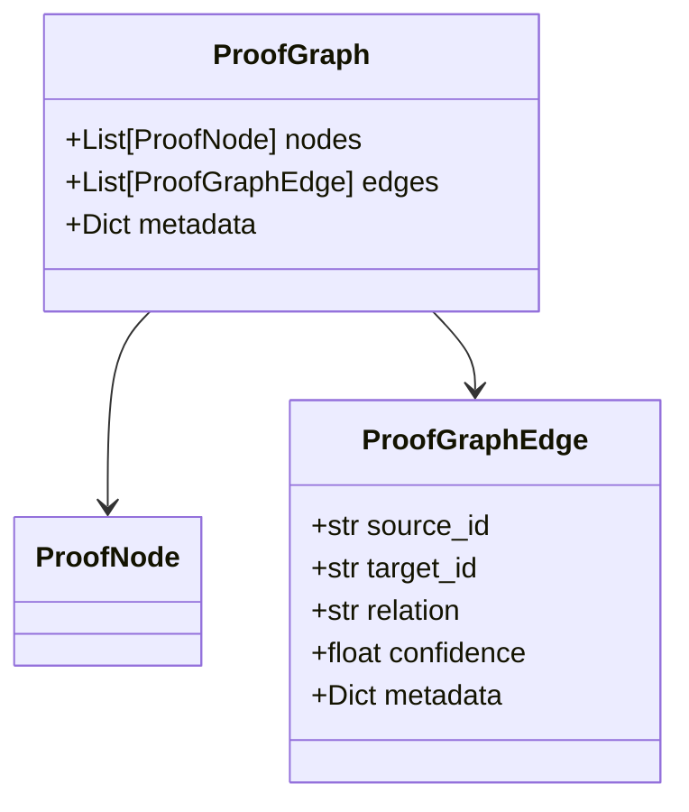
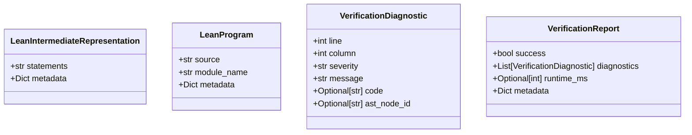
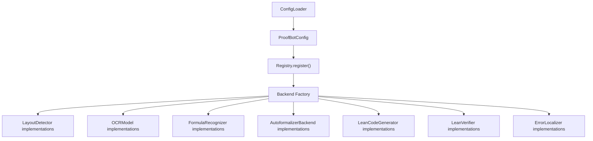

# ProofBot System Implementation Status

## Overview

ProofBot is a modular research system for converting handwritten mathematical proofs into formally verified Lean proofs.

**Current Status**: Package scaffolding complete. All interfaces and stub implementations in place. Ready for concrete model integration.

---

## Package Hierarchy

```
proofbot/
├── core/
│   ├── config.py              # YAML-based configuration loading
│   ├── registry.py            # Backend factory and registration
│   ├── pipeline.py            # Pipeline orchestration
│   ├── interfaces.py          # BackendFactory, StageFactory
│   ├── logging.py             # Shared logging utilities
│   ├── exceptions.py          # ProofBotError base class
│   └── utils.py               # YAML loading helpers
│
├── models/                    # Shared typed data models
│   ├── image.py               # ImageMetadata, NormalizedImage, QualityReport
│   ├── layout.py              # DocumentLayout, LayoutRegion, RegionType
│   ├── ocr.py                 # ParagraphText
│   ├── formula.py             # Formula
│   ├── ast.py                 # ProofAST, ProofNode, ProofNodeType
│   ├── graph.py               # ProofGraph, ProofGraphEdge
│   ├── document.py            # DocumentLayout, PagePolygon
│   ├── lean.py                # LeanProgram, LeanIntermediateRepresentation
│   └── verification.py        # VerificationReport, VerificationDiagnostic
│
├── vision/
│   ├── preprocessing/         # [EXISTING - Image normalization]
│   │   ├── pipeline.py        # PreprocessingPipeline
│   │   ├── models.py          # Stage models
│   │   ├── quality.py         # QualityEstimator implementations
│   │   ├── detection.py       # DocumentDetector implementations
│   │   ├── perspective.py     # PerspectiveCorrector
│   │   ├── orientation.py     # OrientationDetector
│   │   ├── lighting.py        # LightingNormalizer
│   │   ├── denoise.py         # Denoiser
│   │   └── super_resolution.py
│   │
│   ├── layout/                # [NEW - Region detection]
│   │   ├── interfaces.py      # LayoutDetector (ABC)
│   │   ├── detectors.py       # SimpleLayoutDetector (stub)
│   │   ├── models.py          # Helper data models
│   │   └── postprocessing.py  # Region filtering helpers
│   │
│   ├── ocr/                   # [NEW - Text recognition]
│   │   ├── interfaces.py      # OCRModel (ABC)
│   │   ├── recognizers.py     # SimpleOCRModel (stub)
│   │   └── models.py          # ParagraphText
│   │
│   └── formula/               # [NEW - Mathematical expression recognition]
│       ├── interfaces.py      # FormulaRecognizer (ABC)
│       ├── recognizers.py     # SimpleFormulaRecognizer (stub)
│       └── models.py          # Formula
│
├── ast/                       # [NEW - Proof AST construction]
│   ├── interfaces.py          # ProofASTBuilder (ABC)
│   ├── builder.py             # SimpleProofASTBuilder (stub)
│   └── transformer.py         # AST transformation utilities
│
├── graph/                     # [NEW - Proof relationship extraction]
│   ├── interfaces.py          # ProofGraphExtractor (ABC)
│   ├── models.py              # ProofGraph, ProofGraphEdge
│   └── extractor.py           # [TO IMPLEMENT]
│
├── autoformalization/         # [NEW - Lean formalization]
│   ├── interfaces.py          # AutoformalizerBackend (ABC)
│   ├── backends.py            # LLMBackend (stub)
│   └── transformer.py         # Transformation utilities
│
└── lean/                      # [NEW - Lean code generation & verification]
    ├── codegen/
    │   ├── interfaces.py      # LeanCodeGenerator (ABC)
    │   └── generator.py       # SimpleLeanCodeGenerator (stub)
    │
    ├── verification/
    │   ├── interfaces.py      # LeanVerifier (ABC)
    │   └── runner.py          # SimpleLeanVerifier (stub)
    │
    └── errors/
        ├── interfaces.py      # ErrorLocalizer (ABC)
        └── localization.py    # SimpleErrorLocalizer (stub)
```

---

## Data Flow Pipeline



---

## Core Data Models

### Image Pipeline



### Layout Models



### AST Models



### Graph Models



### Lean Models



---

## Abstract Interfaces by Stage

### Vision Pipeline Interfaces

| Stage | Interface | Method | Input | Output |
|-------|-----------|--------|-------|--------|
| Layout Detection | `LayoutDetector` | `detect()` | `NormalizedImage` | `DocumentLayout` |
| Handwriting OCR | `OCRModel` | `transcribe()` | `NormalizedImage`, `region_id` | `ParagraphText` |
| Formula Recognition | `FormulaRecognizer` | `recognize()` | `NormalizedImage`, `region_id` | `Formula` |

### AST & Proof Interfaces

| Stage | Interface | Method | Input | Output |
|-------|-----------|--------|-------|--------|
| AST Builder | `ProofASTBuilder` | `build()` | `DocumentLayout`, `ParagraphText[]`, `Formula[]` | `ProofAST` |
| Graph Extractor | `ProofGraphExtractor` | `extract()` | `ProofAST` | `ProofGraph` |

### Formalization Interfaces

| Stage | Interface | Method | Input | Output |
|-------|-----------|--------|-------|--------|
| Autoformalize | `AutoformalizerBackend` | `formalize()` | `ProofAST`, `ProofGraph` | `LeanIntermediateRep` |
| Lean Codegen | `LeanCodeGenerator` | `generate()` | `LeanIntermediateRep` | `LeanProgram` |
| Lean Verify | `LeanVerifier` | `verify()` | `LeanProgram` | `VerificationReport` |
| Error Localize | `ErrorLocalizer` | `localize()` | `VerificationReport`, `ProofAST`, `DocumentLayout` | `ErrorLocalizationResult[]` |

---

## Current Implementations (Stubs)

✅ = Interface defined | 📝 = Stub implementation | ⚠️ = Ready for ML model integration

| Component | Status | Implementation |
|-----------|--------|-----------------|
| `PreprocessingPipeline` | ✅📝 | Existing image normalization pipeline |
| `SimpleLayoutDetector` | ✅📝 | Returns full-page region as paragraph |
| `SimpleOCRModel` | ✅📝 | Returns empty text |
| `SimpleFormulaRecognizer` | ✅📝 | Returns empty LaTeX |
| `SimpleProofASTBuilder` | ✅📝 | Merges OCR/formula into flat AST |
| `ProofGraphExtractor` | ✅ | [Interface defined, implementation pending] |
| `LLMBackend` | ✅📝 | Returns empty Lean IR |
| `SimpleLeanCodeGenerator` | ✅📝 | Returns empty source |
| `SimpleLeanVerifier` | ✅📝 | Always returns success |
| `SimpleErrorLocalizer` | ✅📝 | Returns empty results |

---

## Configuration System

YAML-based backend selection (not yet implemented):

```yaml
vision:
  preprocessing:
    loader: pil
    quality_assessor:
      backend: basic
    document_detector:
      backend: simple
  layout:
    backend: transformer
    confidence_threshold: 0.4
ocr:
  backend: trocr
  language: en
  beam_size: 5
formula:
  backend: latexocr
  output_format: latex
ast:
  builder:
    backend: rule_based
graph:
  extractor:
    backend: learned
autoformalization:
  backend: openai
  model: gpt-4.1
  max_tokens: 4096
lean:
  codegen:
    backend: heuristic
  verification:
    timeout_seconds: 60
error_localization:
  backend: traceable
```

---

## Registry & Factory Pattern



---

## Next Steps

### Phase 1: Core Pipeline Assembly ✅ DONE
- [x] Architecture design document
- [x] Data model package
- [x] Abstract interfaces for all stages
- [x] Stub implementations
- [x] Registry and config system skeleton

### Phase 2: Pipeline Orchestration 📝 IN PROGRESS
- [ ] `ProofBotPipeline` main class
- [ ] Config loader integration
- [ ] Built-in registry with stubs
- [ ] End-to-end pipeline execution
- [ ] Basic logging and metrics

### Phase 3: Vision Models 🔮 FUTURE
- [ ] Integrate real layout detector (YOLOv11, etc.)
- [ ] Integrate real OCR model (TrOCR, etc.)
- [ ] Integrate real formula recognizer (LaTeX-OCR, etc.)
- [ ] Add quality assessment backend

### Phase 4: AST & Proof Logic 🔮 FUTURE
- [ ] ProofGraphExtractor implementation
- [ ] Relationship inference logic
- [ ] AST validation and normalization

### Phase 5: Lean Integration 🔮 FUTURE
- [ ] Autoformalization LLM backend (OpenAI, Anthropic, local)
- [ ] Lean code generation from IR
- [ ] Lean process runner
- [ ] Error localization mapper

### Phase 6: Research & Refinement 🔮 FUTURE
- [ ] Benchmarking framework
- [ ] Unit tests across all stages
- [ ] Example notebooks
- [ ] Documentation

---

## File Manifest

### Core Infrastructure
- `proofbot/core/__init__.py`
- `proofbot/core/config.py` — Config loader, ProofBotConfig dataclass
- `proofbot/core/registry.py` — Registry for backend implementations
- `proofbot/core/pipeline.py` — Pipeline assembly from config
- `proofbot/core/interfaces.py` — BackendFactory, StageFactory ABCs
- `proofbot/core/logging.py` — Logging utilities
- `proofbot/core/exceptions.py` — ProofBotError base
- `proofbot/core/utils.py` — YAML loading helpers

### Data Models
- `proofbot/models/__init__.py` — Exports all models
- `proofbot/models/image.py` — ImageMetadata, NormalizedImage, QualityReport
- `proofbot/models/layout.py` — DocumentLayout, LayoutRegion, RegionType, BoundingBox
- `proofbot/models/ocr.py` — ParagraphText
- `proofbot/models/formula.py` — Formula
- `proofbot/models/ast.py` — ProofAST, ProofNode, ProofNodeType
- `proofbot/models/graph.py` — ProofGraph, ProofGraphEdge
- `proofbot/models/document.py` — Page metadata
- `proofbot/models/lean.py` — LeanProgram, LeanIntermediateRepresentation
- `proofbot/models/verification.py` — VerificationReport, VerificationDiagnostic

### Vision Preprocessing (Existing)
- `proofbot/vision/preprocessing/` — Complete with all stages

### Vision Layout Detection (New)
- `proofbot/vision/layout/__init__.py`
- `proofbot/vision/layout/interfaces.py` — LayoutDetector ABC
- `proofbot/vision/layout/detectors.py` — SimpleLayoutDetector stub
- `proofbot/vision/layout/models.py` — Helper models
- `proofbot/vision/layout/postprocessing.py` — Region filtering

### Vision OCR (New)
- `proofbot/vision/ocr/__init__.py`
- `proofbot/vision/ocr/interfaces.py` — OCRModel ABC
- `proofbot/vision/ocr/recognizers.py` — SimpleOCRModel stub
- `proofbot/vision/ocr/models.py` — ParagraphText

### Vision Formula Recognition (New)
- `proofbot/vision/formula/__init__.py`
- `proofbot/vision/formula/interfaces.py` — FormulaRecognizer ABC
- `proofbot/vision/formula/recognizers.py` — SimpleFormulaRecognizer stub
- `proofbot/vision/formula/models.py` — Formula

### AST Construction (New)
- `proofbot/ast/__init__.py`
- `proofbot/ast/interfaces.py` — ProofASTBuilder ABC
- `proofbot/ast/builder.py` — SimpleProofASTBuilder stub
- `proofbot/ast/transformer.py` — AST utilities

### Graph Extraction (New)
- `proofbot/graph/__init__.py`
- `proofbot/graph/interfaces.py` — ProofGraphExtractor ABC
- `proofbot/graph/models.py` — ProofGraph, ProofGraphEdge
- `proofbot/graph/extractor.py` — [TO IMPLEMENT]

### Autoformalization (New)
- `proofbot/autoformalization/__init__.py`
- `proofbot/autoformalization/interfaces.py` — AutoformalizerBackend ABC
- `proofbot/autoformalization/backends.py` — LLMBackend stub
- `proofbot/autoformalization/transformer.py` — Utilities

### Lean Code Generation (New)
- `proofbot/lean/__init__.py`
- `proofbot/lean/codegen/__init__.py`
- `proofbot/lean/codegen/interfaces.py` — LeanCodeGenerator ABC
- `proofbot/lean/codegen/generator.py` — SimpleLeanCodeGenerator stub

### Lean Verification (New)
- `proofbot/lean/verification/__init__.py`
- `proofbot/lean/verification/interfaces.py` — LeanVerifier ABC
- `proofbot/lean/verification/runner.py` — SimpleLeanVerifier stub

### Lean Error Localization (New)
- `proofbot/lean/errors/__init__.py`
- `proofbot/lean/errors/interfaces.py` — ErrorLocalizer ABC
- `proofbot/lean/errors/localization.py` — SimpleErrorLocalizer stub

### Root Package
- `proofbot/__init__.py` — Main package exports
- `ARCHITECTURE.md` — Architecture design document (root)
- `SYSTEM.md` — This file (system status tracker)

---

## Key Design Decisions

1. **Interface-First Design**: Every AI-capable component defines an abstract interface. Implementations can be swapped without code changes.

2. **Strong Typing**: All inter-stage communication uses frozen dataclasses. No raw dictionaries.

3. **Modular Stages**: Each stage is independently replaceable. A stage implementation only depends on its input model and output model.

4. **Configuration-Driven**: Backend selection via YAML. The registry maps backend names to implementations.

5. **Stub-First**: All interfaces have stub implementations that return empty/placeholder results. Real models are plugged in as they're developed.

6. **Provenance Tracking**: Metadata and history tracked at every stage for traceability and error localization.

7. **Core Dependencies**: All stages depend on `proofbot.models` and `proofbot.core`, but not on each other.

---

## Usage Example (Future)

```python
from proofbot import ProofBotPipeline, ConfigLoader
from pathlib import Path

# Load config
config = ConfigLoader.load(Path("proofbot.yaml"))

# Create and run pipeline
pipeline = ProofBotPipeline(config)
result = pipeline.run("path/to/handwritten_proof.jpg")

# Access outputs
print(f"Success: {result.verification.success}")
print(f"Errors: {result.verification.diagnostics}")
print(f"Lean code:\n{result.lean_program.source}")
```

---

## Summary

- ✅ **Architecture**: Fully designed and documented
- ✅ **Packages**: All directories and modules created
- ✅ **Interfaces**: All ABCs defined
- ✅ **Models**: All data models implemented
- ✅ **Stubs**: All stages have placeholder implementations
- ⏳ **Integration**: Main pipeline class ready to build
- 🔮 **Real Models**: Ready for ML integration

The system is ready for concrete model integration and pipeline orchestration.
